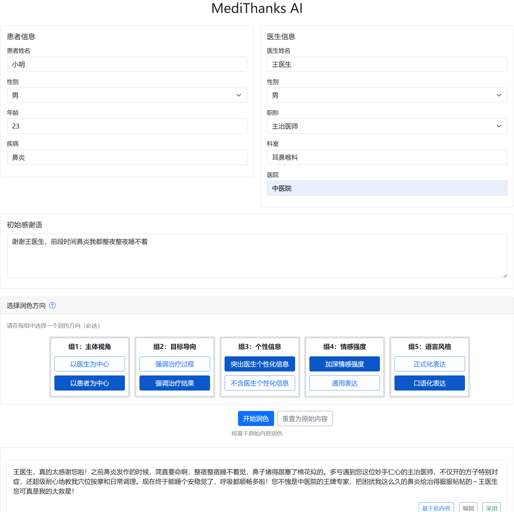

# MediThanks AI - 医患感谢信智能生成系统

<p align="center">
  
  
  
</p>

## 贡献者

<!-- readme: collaborators,contributors -start -->

<!-- readme: collaborators,contributors -end -->

## 项目简介

MediThanks AI 是一个基于人工智能的医患感谢信生成系统，帮助患者为医生创建个性化、专业化的感谢信。系统通过DeepSeek AI API对用户输入的初始感谢内容进行智能润色，提供多种风格和角度的表达方式。

该系统旨在改善医患关系，通过技术手段帮助患者更好地表达对医生的感激之情，同时减轻患者在表达感谢时的语言组织压力。

<p align="center">
  
</p>

## 核心功能

- 📝 **感谢信智能润色**：基于AI技术提供多种风格的感谢信润色
- ⚙️ **多维度定制**：5个维度的润色选项（主体视角、目标导向、个性信息、情感强度、语言风格）
- 👥 **用户友好界面**：直观的Web界面，易于操作
- 🗃️ **数据管理**：完整的数据存储和管理功能
- 📊 **数据导出**：支持将数据导出为Excel格式
- 🔐 **管理员功能**：数据查看和导出的管理界面
- 🐳 **Docker支持**：容器化部署，便于快速部署和扩展

## 技术架构

- **后端框架**：Python Flask
- **数据库**：SQLite + SQLAlchemy ORM
- **前端技术**：HTML5, CSS3, JavaScript, Bootstrap 5
- **AI服务**：DeepSeek API
- **部署方案**：Docker容器化支持
- **数据导出**：pandas + openpyxl

## 快速开始

### 环境要求

- Python 3.10+
- pip 包管理器
- DeepSeek API密钥

### 安装步骤

1. 克隆项目代码：
```bash
git clone <repository-url>
cd MediThanksAI
```

2. 安装依赖：
```bash
pip install -r requirements.txt
```

3. 设置环境变量：
```bash
export DEEPSEEK_API_KEY=your_api_key_here
```

4. 初始化数据库并启动服务：
```bash
python main.py
```

5. 访问应用：
在浏览器中打开 `http://localhost:8000`

### Docker部署

项目支持Docker容器化部署：

```bash
# 构建镜像
docker build -t medithanks-ai .

# 运行容器
docker run -p 8000:8000 -e DEEPSEEK_API_KEY=your_api_key_here medithanks-ai
```

## 使用指南

### 基本使用流程

1. **填写基本信息**：
   - 患者信息（姓名、性别、年龄、疾病）
   - 医生信息（姓名、性别、职称、科室、医院）

2. **输入初始感谢语**：
   - 至少输入15个字符的感谢内容
   - 表达对医生的感激之情

3. **选择润色方向**：
   - 主体视角：以医生为中心 / 以患者为中心
   - 目标导向：强调治疗过程 / 强调治疗结果
   - 个性信息：突出医生个性化信息 / 不含医生个性化信息
   - 情感强度：加深情感强度 / 通用表达
   - 语言风格：正式化表达 / 口语化表达

4. **生成润色结果**：
   - 点击"开始润色"按钮生成多个版本
   - 查看、编辑和选择最合适的版本

5. **采用选定版本**：
   - 点击"采用"按钮，内容将自动复制到剪贴板
   - 可继续编辑润色结果以满足个人需求

### 高级功能

- **基于已有润色结果继续润色**：选择一个润色结果作为基础，进行进一步润色
- **编辑润色结果**：对AI生成的结果进行手动修改
- **重置为原始内容**：回到最初的感谢语进行重新润色

### 管理员功能

管理员可以通过以下URL访问管理功能：
- 数据查看：`/view_data?token=管理令牌`
- 数据导出：`/export_data?token=管理令牌`

## 目录结构

```
MediThanksAI/
├── main.py              # 主应用文件
├── requirements.txt     # Python依赖
├── Dockerfile           # Docker配置
├── prompts.xlsx         # AI提示词模板
├── create_prompts.py    # 提示词生成脚本
├── instance/            # 数据库文件
│   └── thankyou_letters.db
├── static/              # 静态资源
│   └── css/
│       └── style.css
└── templates/           # HTML模板
    ├── index.html       # 主页面
    ├── index2.html      # 备用主页面
    ├── admin.html       # 管理页面
    ├── view_data.html   # 数据查看页面
    └── copy_success.html # 复制成功页面
```

## 数据库设计

### 主要数据表

1. **patients**（患者表）
   - id：患者ID
   - patient_name：患者姓名
   - gender：性别
   - age：年龄
   - disease：疾病
   - created_at：创建时间

2. **letters**（感谢信表）
   - id：感谢信ID
   - patient_id：患者ID（外键）
   - 医生相关信息（姓名、性别、职称、科室、医院）
   - original_text：原始感谢语
   - created_at：创建时间

3. **polish_history**（润色历史表）
   - id：润色记录ID
   - letter_id：感谢信ID（外键）
   - previous_text：润色前文本
   - polished_text：润色后文本
   - polish_options：润色选项
   - created_at：创建时间

4. **adopted_polish**（采纳记录表）
   - id：采纳记录ID
   - patient_id：患者ID（外键）
   - letter_id：感谢信ID（外键）
   - polish_id：润色记录ID（外键）
   - created_at：创建时间

5. **user_actions**（用户行为表）
   - id：行为记录ID
   - patient_id：患者ID（外键）
   - 患者信息（姓名、性别、年龄、疾病）
   - action_type：行为类型
   - action_detail：行为详情
   - letter_id：感谢信ID
   - polish_id：润色记录ID
   - created_at：创建时间

## API集成

本项目集成了DeepSeek API用于文本润色功能：

- **API提供商**：DeepSeek
- **模型**：deepseek-chat
- **功能**：文本润色和改写
- **配置**：通过环境变量设置API密钥

## 开发指南

### 项目依赖

主要的Python依赖包包括：
- Flask：Web框架
- Flask-SQLAlchemy：数据库ORM
- pandas：数据处理
- openai：DeepSeek API客户端
- openpyxl：Excel文件处理

### 代码结构

- `main.py`：应用主入口，包含所有路由和业务逻辑
- `create_prompts.py`：生成AI提示词模板的脚本
- `templates/`：前端HTML模板
- `static/`：静态资源文件
- `requirements.txt`：项目依赖列表

### 数据模型

使用SQLAlchemy定义了5个主要数据模型：
1. Patient：患者信息
2. Letter：感谢信内容
3. PolishHistory：润色历史记录
4. AdoptedPolish：采纳记录
5. UserAction：用户行为记录

## 配置说明

### 环境变量

- `DEEPSEEK_API_KEY`：DeepSeek API密钥
- `ADMIN_TOKEN`：管理员访问令牌（在代码中设置）

### 数据库配置

- 使用SQLite数据库，默认路径为 `instance/thankyou_letters.db`
- 数据库URI在 `main.py` 中配置

## 常见问题

### 1. 如何获取DeepSeek API密钥？
访问DeepSeek官网注册账号并获取API密钥。

### 2. 如何访问管理员功能？
在URL后添加 `?token=管理令牌` 参数访问管理页面。

### 3. 如何导出数据？
管理员可以通过管理页面导出所有数据为Excel文件。

### 4. 支持哪些部署方式？
支持直接运行Python脚本和Docker容器化部署。

## 贡献指南

欢迎提交Issue和Pull Request来改进项目：

1. Fork项目
2. 创建功能分支 (`git checkout -b feature/AmazingFeature`)
3. 提交更改 (`git commit -m 'Add some AmazingFeature'`)
4. 推送到分支 (`git push origin feature/AmazingFeature`)
5. 开启Pull Request

## 许可证

本项目采用MIT许可证 - 查看 [LICENSE](LICENSE) 文件了解详情。

## 作者

项目由MediThanks AI开发团队维护。

## 致谢

- 感谢DeepSeek提供的AI服务支持
- 感谢Flask框架提供的Web开发支持
- 感谢所有为项目贡献的开发者
